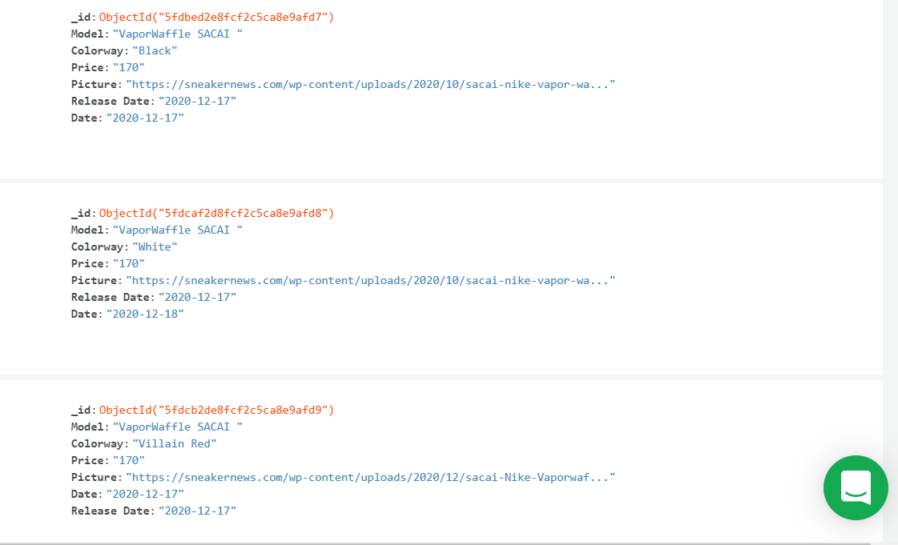

# Atlas MongoDB + Express Database ! 

The objective of this program is to perform CRUD operations using Node, Mongo-Db and Express on a remote database (Atlas cloud), 
the database in the example already receive many sneakers object in the sneakers collection of the JulienQHN database.




### What can you do ? 

You can make the basic CRUD operations like :
  - Connect to your own Data base
  - Get informations from specific collection of the database
  - Make CRUD operations
      - Create an object (insert)
      - Read the list of objectfs or a specific one (find)
      - Update a specific object (update)
      - Delete an object of the collection
      
### How to Use 
Open your Terminal and run these commands.

First cd to the right folder :
```sh
cd (or your own folder)
```
Start :
```sh
$ npm run dev
```

